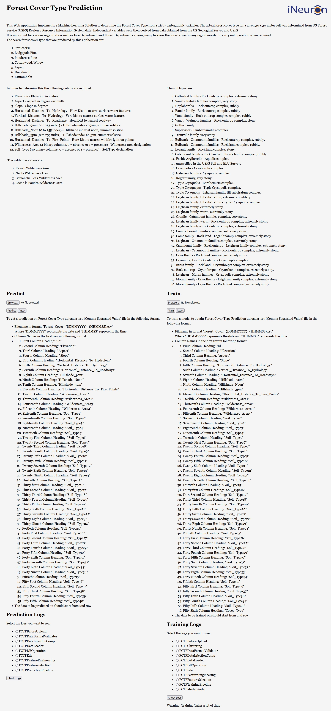
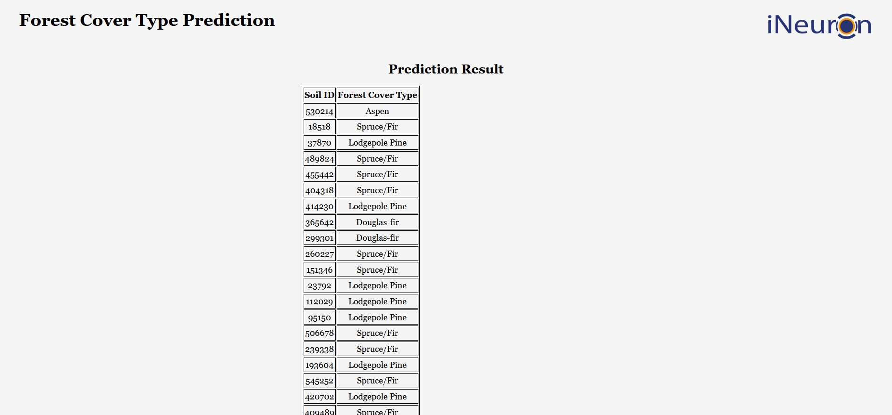

# Forest-Cover-Type-Prediction




* This repository implements "Forest Cover Type Prediction" project work done through internship at ineuron.ai.
* With the help of this project we can determine the Forest Cover Type from strictly cartographic variables

## Description
* This implementation requires fifty five inputs from the user in a CSV file which the user can upload through the web application. the inputs are described as follows
    1. “Id” (input) - Soil Sample Id
    2. “Elevation” (input) - Elevation in metres
    3. “Aspect” (input) - Aspect in degrees azimuth
    4. “Slope” (input) - Slope in degrees
    5. “Horizontal_Distance_To_Hydrology” (input) - Horz Dist to nearest surface water features
    6. “Vertical_Distance_To_Hydrology” (input) - Vert Dist to nearest surface water features
    7. “Horizontal_Distance_To_Roadways” (input) - Horz Dist to nearest roadway
    8. “Hillshade_9am” (input) - Hillshade index at 9am, summer solstice
    9. “Hillshade_Noon” (input) - Hillshade index at noon, summer solstice
    10. “Hillshade_3pm” (input) - Hillshade index at 3pm, summer solstice
    11. “Horizaontal_Distance_To_Fire_Points” (input) - Horz Dist to nearest wildfire ignition points
    12. “Wilderness_Area1” (input) - Rawah Wilderness Area
    13. “Wilderness_Area2” (input) - Neota Wilderness Area
    14. “Wilderness_Area3” (input) - Comanche Peak Wilderness Area
    15. “Wilderness_Area4” (input) - Cache la Poudre Wilderness Area
    16. “Soil_Type1” (input) - Cathedral family - Rock outcrop complex, extremely stony.
    17. “Soil_Type2” (input) - Vanet - Ratake family complex, very stony.
    18. “Soil_Type3” (input) - Haploborolis - Rock outcrop complex, rubbly
    19. “Soil_Type4” (input) - Ratake family - Rock outcrop complex, rubbly
    20. “Soil_Type5” (input) - Vanet family - Rock outcrop complex complex, rubbly
    21. “Soil_Type6” (input) - Vanet - Wetmore families - Rock outcrop complex, stony
    22. “Soil_Type7” (input) - Gothic family
    23. “Soil_Type8” (input) - Supervisor - Limber families complex
    24. “Soil_Type9” (input) - Troutville family, very stony.
    25. “Soil_Type10” (input) - Bulwark - Catamount families - Rock outcrop complex, rubbly.
    26. “Soil_Type11'' (input) - Bulwark - Catamount families - Rock land complex, rubble.
    27. “Soil_Type12” (input) - Legault family - Rock land complex, stony.
    28. “Soil_Type13” (input) - Catamount family - Rock land - Bulwark family complex, rubble.
    29. “Soil_Type14” (input) - Pachic Argiborolis - Aquolis complex.
    30. “Soil_Type15” (input) - unspecified in the USFS Soil and ELU Survey.
    31. “Soil_Type16” (input) - Cryaquolis - Cryoborolis complex.
    32. “Soil_Type17” (input) - Gateview family - Cryaquolis complex.
    33. “Soil_Type18” (input) - Rogert family, very stony.
    34. “Soil_Type19” (input) - Typic Cryaquolis - Borohemists complex.
    35. “Soil_Type20” (input) - Typic Cryaquepts - Typic Cryaquolls complex.
    36. “Soil_Type21” (input) - Typic Cryaquolls - Leighcan family, till substratum complex.
    37. “Soil_Type22” (input) - Leighcan family, till substratum, extremely bouldery.
    38. “Soil_Type23” (input) - Leighcan family, till substratum - Typic Cryaquolls complex.
    39. “Soil_Type24” (input) - Leighcan family, extremely stony.
    40. “Soil_Type25” (input) - Leighcan family, warm, extremely stony.
    41. “Soil_Type26” (input) - Granile - Catamount families complex, very stony.
    42. “Soil_Type27” (input) - Leighcan family, warm - Rock outcrop complex, extremely stony.
    43. “Soil_Type28” (input) - Leighcan family - Rock outcrop complex, extremely stony.
    44. “Soil_Type29” (input) - Como - Legault families complex, extremely stony.
    45. “Soil_Type30” (input) - Como family - Rock land - Legault family complex, extremely stony.
    46. “Soil_Type31” (input) - Leighcan - Catamount families complex, extremely stony.
    47. “Soil_Type32” (input) - Catamount family - Rock outcrop - Leighcan family complex, extremely stony.
    48. “Soil_Type33” (input) - Leighcan - Catamount families - Rock outcrop complex, extremely stony.
    49. “Soil_Type34” (input) - Cryorthents - Rock land complex, extremely stony.
    50. “Soil_Type35” (input) - Cryumbrepts - Rock outcrop - Cryaquepts complex.
    51. “Soil_Type36” (input) - Bross family - Rock land - Cryumbrepts complex, extremely stony.
    52. “Soil_Type37” (input) - Rock outcrop - Cryumbrepts - Cryorthents complex, extremely stony.
    53. “Soil_Type38” (input) - Leighcan - Moran families - Cryaquolls complex, extremely stony.
    54. “Soil_Type39” (input) - Moran family - Cryorthents - Leighcan family complex, extremely stony.
    55. “Soil_Type40” (input) - Moran family - Cryorthents - Rock land complex, extremely stony.

* The output is represented in a tabular form along with the corresponding " Soil Id".
* The Web Application which implements this repository also provides the facility to retrain the model used to predict Forest Cover Type. 
* We can also see the logs to understand whether the application is working properly.

## **Workflow**


## **Dataset**
* The dataset used for training the model is available [here](https://www.kaggle.com/c/forest-cover-type-prediction/data)

## **Installation**

### **Requirements**

* Python 3.5+
* scikit-learn 1.0.2
* xgboost 0.90
* pandas 1.3.5
* numpy 1.21.6
* Flask 2.1.2
* cassandra-driver 3.25.0

### **Setup**
1. Install Machine Learning Libraries
```
pip install scikit-learn==1.3.5 xgboost==0.90 pandas==1.3.5
```
2. Install Library for hosting Web Application on heroku
```
pip install Flask==2.1.2
```
3. Install Database interface libary
```
pip install cassandra-driver==3.25.0
```
4. Install supporting libraries
```
pip install pandas==1.3.5 numpy==1.21.6
```


## **Implementation**
* A working implementation of the project as a Web Application in this repository is available [here](https://forest-cover-type-pred-joma.herokuapp.com/)

## **Contributors**
* [Jobin Mathew](https://www.linkedin.com/in/jobin-mathew-78b782149/)
* [Vineet Kumar]()